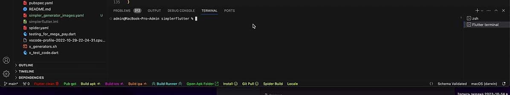
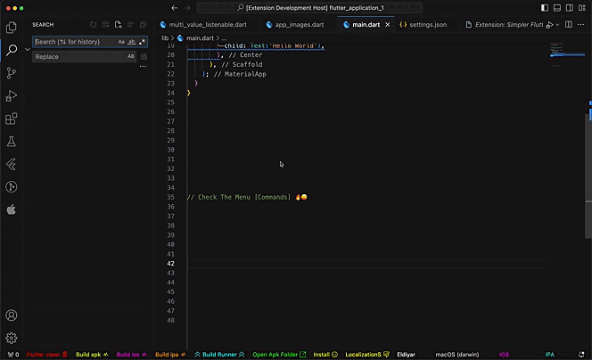

<div align="center">
  <h1>Task for Visual Studio Code</h1>
</div>



## Menu Explorer Vs Code



## Open APk Folder


## Hide / Show Icon


`Copy this json and add to your VsCode settings.json` 

```json
  "SimplerFlutterTasks.flutterCleanIcon": "show",
  "SimplerFlutterTasks.flutterPubGetIcon": "show",
  "SimplerFlutterTasks.buildApkIcon": "show",
  "SimplerFlutterTasks.iosIcon": "show",
  "SimplerFlutterTasks.ipaIcon": "show",
  "SimplerFlutterTasks.buildRunnerIcon": "show",
  "SimplerFlutterTasks.installIcon": "show",
  "SimplerFlutterTasks.openApkIcon": "show",
  "SimplerFlutterTasks.gitPullIcon": "hide",
  "SimplerFlutterTasks.smallApkIcon": "hide",
  "SimplerFlutterTasks.spiderBuildIcon": "hide",
  "SimplerFlutterTasks.easyLocalizationsIcon": "hide",
  "SimplerFlutterTasks.createNewTerminal": false,
```

<div align="center">
  <h1>Custom Commands</h1>
</div>


`Create your Custom Commands`  
`copy this json and add to your VsCode settings.json` 
create more commands

- [Icons for Simpler Flutter Tasks](https://code.visualstudio.com/api/references/icons-in-labels#icon-listing)


### Custom Commands
```json
"SimplerFlutterTasks.customCommandsList": [
    {
        "label": "LocalizationS $(github-action)",
        "command": "flutter pub get",
        "enabled": true,
        "color": "#00ff22",
        "position": "right"
    },
    {
        "label": "Custom Command 2 $(globe)",
        "command": "flutter build apk",
        "enabled": true,
        "color": "#09eeb5",
        "position": "right", 
    },
],
```


### Table of Contents
A set of helpful Flutter and Dart commands for day to day Flutter development.

- [Installation](#installation)
- [Features](#Features)
- [Commands](#Commands)
- [Requirements](#Requirements)
- [Reference](#Reference)

## Installation

- Name of Package - Simpler Flutter tasks - [Icons](https://code.visualstudio.com/api/references/icons-in-labels#icon-listing)
- [Visual Studio Code | Visual Studio Marketplace](https://marketplace.visualstudio.com/items?itemName=Eldiyar-Dev.simpler-flutter-tasks)

## Features

Simply Flutter / Dart commands

I'm working hard to select all the day to day commands, so wait for more commands!.

## Commands

`Flutter related Commands`  

| Flutter quick commands   |    Visibility icons   |
| -------------------------|-----------------------|
| `Flutter clean`          |    default  -  show   |
| `Flutter pub get`        |    default  -  show   |
| `Flutter build apk`      |    default  -  show   |
| `Flutter build ios`      |    default  -  show   |
| `Flutter build ipa`      |    default  -  show   |
| `flutter install`        |    default  -  show   |
| `Build runner`           |    default  -  show   |
| `Open Apk Folder`        |    default  -  show   |
| `Git pull`               |    default  -  hide   |
| `Small Apk`              |    default  -  hide   |
| `Spider Build`           |    default  -  hide   |
| `Easy Localizations`     |    default  -  hide   |


## Not Released yet --------- ❌
Planning 

### 3.0.6
  - I Will add to Explorer tab ❌
    - without settings ❌

### 3.0.5
  - Settings Tabs ❌
    - Always Expand  ❌
    - Always Collapsed ❌

### 3.0.4
  - Editing Easy Localizations ❌
  - Add Open Ios Folder ❌
  - Add Open Ipa Folder ❌

## Release Notes 🔥 🔥 🔥 🔥 🔥 🔥 🔥 ------- ✅

### 3.0.3
  - Optimize Starting Ios Commands ✅ -- beta test only for MAC
    - pod install
    - pod update
    - pod cache clean --all
    - pod repo update

  - Added refresh Tab's button
  - Added Collapse All Tab's button
  - Added Tab's Git Hub ✅
    - you can't start the command only COPY | it will be safer this way
      - Init Repo
      - Git Cancelers
      - Git Repo


### 3.0.2
  - adding Tab's settings ✅
    - I will add settings to my other extensions. ✅
      - `Simpler FLutter Tasks`
      - `Simpler FLutter Snippets`
      - `Simpler FLutter Generators`


      
### 3.0.1 
  - Added Tabs
    - Android ✅
    - IOS ✅
    - Copy The Command on menu View ✅
    - Start Command on menu view ✅


### 3.0.0 
  - Updated Menu Explorer 
    - added new tab `Settings` ✅
      - Hide / Show Icon -> `Now it’s convenient to change the visibility of status bar icons` ✅
      - Start + Copy The Command ✅
      - Added Numbering The Command ✅ 

### 2.8.7 
  - Auto Updating Localizations from Json, 
       now you do not have to reload vs code ✅
  - Vs Code `Menu Explorer Commands`  🔥 🔥 🔥
    - Build Runner ✅
      - dart run build_runner build
      - dart run build_runner build --delete-conflicting-outputs
      - dart run build_runner build --delete-conflicting-outputs -v
    - Flutter Commands ✅
      - flutter --version
      - flutter doctor -v
      - flutter pub outdated
      - flutter upgrade
      - flutter pub get
      - flutter pub upgrade
      - flutter devices
      - flutter analyze
      - dart fix --apply
      - dart format .
      - flutter clean
    - .... so wait for more commands....!
  
  - Optimized Code - (Commands) ✅

### 2.8.3-4-5-6
  - what's new
    - custom commands  [Try Now](#Custom-Commands)
        - right / left
        - "position": "right",  --> NEW ✅ ✅ <br><br> 
        

    - Start the Command to new Terminal <br>
        - `"SimplerFlutterTasks.createNewTerminal": true,`

### 2.8.2
  - Fixed Open Apk Folder
    - Mac ✅
    - Linux ✅
    - Windows ✅

### 0.2.6
  - Fixed Custom Commands
  - The Command `flutter clean` now work with `flutter pub get`
### 0.2.5
  - Added feature
    - hide / show icon
      - Flutter Clean
      - Flutter Pub get

### 0.2.3-4
  - Custom Commands auto updating, now you don't have to reload the VisualStudio Code

### 0.2.2
  - Новая Фича [new feature]
  - Custom Commands
    - Create your own commands

### 0.2.1
  - New Commands
    - Small Apk:
    - Spider Build:
    - Easy Localizations
      - default value 
        - dart run easy_localization:generate -S assets/langs -O lib/langs
        - dart run easy_localization:generate -S assets/langs -f keys -o locale_keys.g.dart 
        
  - Added Hide / Show Icon
    - flutter clean:
    - flutter pub get:
    - flutter build apk:
    - flutter build ios:
    - flutter build ipa:
    - flutter install:
    - Build runner:
    - Open Apk Folder:
    - Small Apk:
    - Spider Build:
    - Easy Localizations:
  
  - Change Visibility icons in Extension's Settings |Simpler Flutter Tasks|

### 0.2.0

  - Git pull
    - Just Git Pulling
    - adding Beta testing hide or show icon " git pull icon by default is hide "
    - open settings vs code -> search simpler flutter tasks -> there the set hide or show git pull icon
   
### 0.1.9

- Optimized
  - starting commands

### 0.1.8

- Flutter Install
  - installing

### 0.1.6-7

- Fixed bugs with terminal

### 0.1.5

- Build runner:
  - dart run build_runner build --delete-conflicting-outputs
- Open Apk Folder:
  - opening apk folder, if not exists "app-release.apk" -> open |build/outputs|
    - Mac ✅
    - Linux ❌
    - Windows ❌

### 0.1.0

- flutter clean:
  - just cleaning project.
- flutter pub get:
  - get all dependencies 
- flutter build apk:
  - Build for android
- flutter build ios:
  - Build for ios
- flutter build ipa:
  - Build for ipa


### 0.0.1

Initial release


## Requirements

Vscode: ^1.82.0

## Reference

[Simpler Flutter Snippet](https://marketplace.visualstudio.com/items?itemName=Eldiyar-Dev.simpler-flutter-snippets)
[Simpler Flutter Generator](https://marketplace.visualstudio.com/items?itemName=Eldiyar-Dev.simpler-flutter-generator)

Enjoy !!!! 😉 
